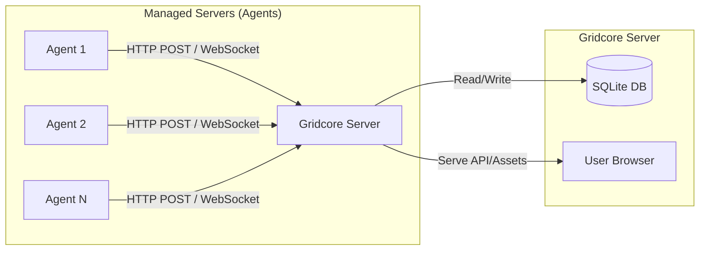

# Gridcore 项目开发文档

## 1. 项目概述

**Gridcore** 是一个轻量级的服务器监控探针系统。它由两个主要部分组成：
1.  **服务端 (Server)**：接收来自客户端的数据，提供 Web 面板进行可视化监控和管理。
2.  **客户端 (Agent/Probe)**：部署在被监控的服务器上，负责采集系统指标并上报给服务端。

## 2. 技术栈

### 2.1 服务端 (Server)
-   **前端**：React (使用 Vite 构建) + Ant Design (或类似 UI 库) + Recharts (图表库)
-   **后端**：Node.js (Express 或 Koa)
-   **数据库**：SQLite (轻量级，无需额外部署数据库服务)
-   **通信协议**：HTTP REST API + WebSocket (可选，用于实时状态推送)

### 2.2 客户端 (Agent)
-   **语言**：Go (Golang)
-   **核心库**：`gopsutil` (用于采集系统信息), `net/http` (用于上报数据)
-   **特性**：单二进制文件，无依赖，跨平台 (Linux/Windows)。

## 3. 系统架构



## 4. 目录结构规划

```
Gridcore/
├── docs/               # 项目文档
├── server/             # 服务端代码 (Monorepo 风格或独立)
│   ├── frontend/         # 前端 React 项目
│   │   ├── src/
│   │   └── package.json
│   ├── backend/        # 后端 Node.js 项目
│   │   ├── src/
│   │   ├── db/         # SQLite 数据库文件及迁移脚本
│   │   └── package.json
│   └── package.json    # (可选) 用于管理整个 server 目录
├── agent/              # Go 客户端代码
│   ├── cmd/
│   ├── internal/
│   │   ├── collector/  # 数据采集逻辑
│   │   ├── sender/     # 数据上报逻辑
│   │   └── config/     # 配置管理
│   └── go.mod
└── README.md
```

## 5. 数据库设计 (SQLite)

### 5.1 Servers 表 (服务器列表)
存储被监控服务器的基本信息。

| 字段名 | 类型 | 说明 |
| :--- | :--- | :--- |
| id | INTEGER PK | 自增 ID |
| uuid | TEXT | 服务器唯一标识 (Agent 生成或 Server 分配) |
| name | TEXT | 服务器显示名称 |
| ip | TEXT | 上报 IP 地址 |
| os | TEXT | 操作系统信息 |
| status | INTEGER | 状态 (0: 离线, 1: 在线) |
| last_seen | DATETIME | 最后上报时间 |
| secret | TEXT | 通讯密钥 (用于鉴权) |

### 5.2 Metrics 表 (监控指标历史)
存储历史监控数据，用于生成图表。
*注：考虑到 SQLite 性能，建议定期清理旧数据或仅存储聚合数据。*

| 字段名 | 类型 | 说明 |
| :--- | :--- | :--- |
| id | INTEGER PK | 自增 ID |
| server_id | INTEGER | 关联 Servers 表 ID |
| cpu_usage | REAL | CPU 使用率 (%) |
| ram_usage | REAL | 内存使用率 (%) |
| disk_usage | REAL | 磁盘使用率 (%) |
| net_in | INTEGER | 入网流量 (bytes) |
| net_out | INTEGER | 出网流量 (bytes) |
| timestamp | DATETIME | 记录时间 |

## 6. API 接口设计

### 6.1 Agent 通信接口

#### 6.1.1 上报监控数据 (Heartbeat & Metrics)
-   **URL**: `/api/agent/report`
-   **Method**: `POST`
-   **Headers**: 
    -   `Authorization`: `Bearer <Server-Secret>`
-   **Body**:
    ```json
    {
        "uuid": "server-uuid-xxx",
        "os": "Ubuntu 22.04",
        "cpu": 15.5,          // CPU 使用率
        "ram": 45.2,          // 内存使用率
        "disk": 60.1,         // 磁盘使用率
        "net_in": 102400,     // 累计流量或速率
        "net_out": 204800
    }
    ```
-   **Response**: `200 OK`

### 6.2 前端管理接口

#### 6.2.1 获取服务器列表
-   **URL**: `/api/servers`
-   **Method**: `GET`

#### 6.2.2 获取服务器详情及历史数据
-   **URL**: `/api/servers/:id/metrics`
-   **Method**: `GET`
-   **Query**: `range=1h` (时间范围)

## 7. 开发计划

### 第一阶段：原型验证 (MVP)
1.  **服务端后端**：搭建 Express + SQLite，实现 `/report` 接口接收数据并打印/存储。
2.  **客户端 Agent**：使用 Go 编写简单的采集脚本，每 2 秒采集一次 CPU/内存并发送给服务端。
3.  **服务端前端**：搭建 React 页面，轮询获取服务器列表并展示实时状态。

### 第二阶段：功能完善
1.  **鉴权机制**：Agent 与 Server 之间增加 Token 验证。
2.  **历史数据**：完善 Metrics 存储，前端增加历史趋势图表。
3.  **WebSocket**：将前端轮询改为 WebSocket 推送，降低延迟。

### 第三阶段：部署与优化
1.  **Agent 打包**：利用 Go 交叉编译生成 Windows/Linux 可执行文件。
2.  **Docker 化**：服务端提供 Docker 镜像，一键部署。
3.  **告警功能**：当 CPU/内存 超过阈值时发送通知 (Email/Telegram)。

## 8. 详细实施步骤

### 8.1 初始化项目
```bash
# 创建目录
mkdir -p Gridcore/{server/client,server/service,agent}

# 初始化 Go 模块
cd agent
go mod init gridcore-agent

# 初始化 Node 后端
cd ../server/service
npm init -y
npm install express sqlite3 sequelize cors body-parser

# 初始化 React 前端
cd ../client
npm create vite@latest . -- --template react
npm install
```

### 8.2 Agent 开发 (Go)
关键库推荐：
-   `github.com/shirou/gopsutil/v3` (系统信息采集)
-   `github.com/go-resty/resty/v2` (HTTP 请求客户端)

### 8.3 Server 后端开发 (Node.js)
关键点：
-   使用 `sequelize` 或 `knex` 操作 SQLite。
-   设置定时任务清理过期的 Metrics 数据 (如只保留最近 24 小时)。

### 8.4 Server 前端开发 (React)
关键点：
-   Dashboard 布局：卡片式展示每个服务器状态。
-   状态指示灯：根据 `last_seen` 判断服务器是否在线 (如超过 10秒未上报则视为离线)。
